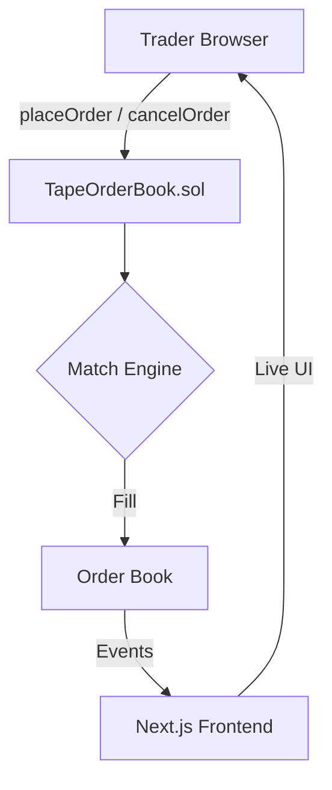

# Tape — On-Chain Limit Order Book

> 🏆 Hackathon Project — Built for BOT Chain

**Tape** is a fully on-chain limit order book. Every order placement, match, and cancellation is its own confirmed transaction on **BOT Chain** — a high-performance L1 EVM blockchain.

## How It Works



## Contract

The UI always talks to the address in `lib/config.ts`:

```ts
contractAddress: "0x55Fa3C86C38FEE7F3587D883D6300d3243507CF0"
```

Deploy / upgrade with Hardhat (not the web UI), then put the new address in that config field:

```bash
npx hardhat compile
PRIVATE_KEY=0xYOUR_KEY npx hardhat run scripts/deploy.ts --network botchain-testnet
```

## Project Structure

```
tape/
├── app/                    # Next.js 16 App Router
│   ├── page.tsx            # Landing (goal + product story)
│   ├── trade/page.tsx      # Trading terminal
│   ├── layout.tsx          # Root layout + providers
│   ├── globals.css         # Global styles + Tailwind v4
│   └── components/         # UI components
├── lib/                    # Config, ABI, bytecode
├── contracts/              # TapeOrderBook.sol
├── scripts/                # Deploy scripts
└── bot/                    # Market-making bot
```

## Getting Started

```bash
npm install
npm run dev
```

- Landing: [http://localhost:3000](http://localhost:3000)
- Trade: [http://localhost:3000/trade](http://localhost:3000/trade)

The book loads from the configured contract over RPC; connect a wallet only to place or cancel orders.

## Features

- **Live Order Book** — On-chain depth, polled every 2s via `getBookSide`
- **Price chart** — SVG line from real `OrderMatched` fills
- **Limit Orders** — Buy/sell with price (gwei) & quantity, matched on-chain
- **Recent Trades** — Real-time `OrderMatched` event tape
- **My Orders** — Open orders with on-chain cancel
- **Wallet Connect** — MetaMask + BOT Chain Testnet add/switch
- **Responsive** — Mobile-first trading layout
