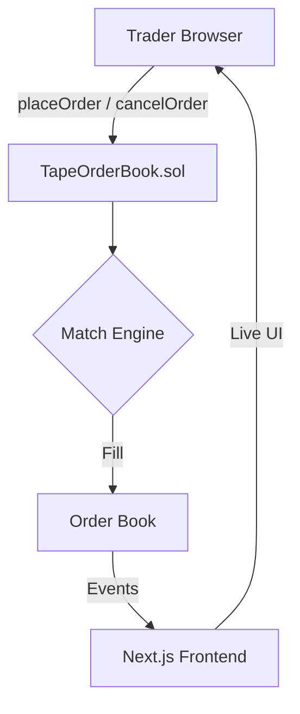

# Tape — On-Chain Limit Order Book

> 🏆 Hackathon Project — Built for BOT Chain

**Tape** is a fully on-chain limit order book. Every order placement, match, and cancellation is its own confirmed transaction on **BOT Chain** — a high-performance L1 EVM blockchain.

## How It Works



## Deployed Contract

| Network | Address |
|---------|---------|
| **Testnet** | `0xFFFC911869A14f2D9d25A05D0CcA3BE7c6135cA8` |
| **Explorer** | [scan.bohr.life](https://scan.bohr.life/address/0xFFFC911869A14f2D9d25A05D0CcA3BE7c6135cA8) |

## Project Structure

```
tape/
├── app/                    # Next.js 16 App Router
│   ├── layout.tsx          # Root layout + WalletProvider
│   ├── page.tsx            # Main trading page
│   ├── globals.css         # Global styles + Tailwind v4
│   └── components/         # 9 UI components
├── lib/                    # Config, ABI, seed data
├── contracts/              # TapeOrderBook.sol
├── scripts/                # Deploy scripts
└── bot/                    # Market-making bot
```

## Getting Started

```bash
npm install
npm run dev
```

Open [http://localhost:3000](http://localhost:3000).

### Deploy Your Own

```bash
npx hardhat compile
npx hardhat run scripts/deploy.ts --network botchain-testnet
```

## Features

- **Live Order Book** — Depth visualization with animated updates
- **Limit Orders** — Buy/sell with price & quantity
- **Price Chart** — SVG sparkline with gradient area fill
- **Recent Trades** — Real-time trade tape with time-ago
- **My Orders** — Open/filled/cancelled with cancel action
- **Wallet Connect** — MetaMask + BOT Chain network switching
- **Seeded Data** — Full demo without wallet
- **Responsive** — Mobile-first design

