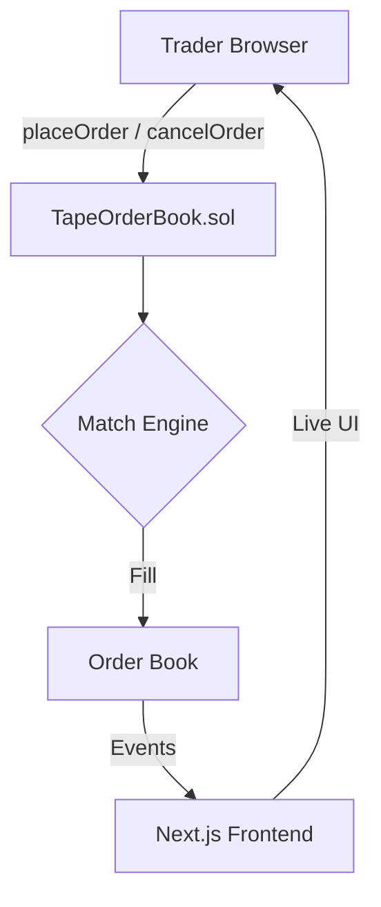

# Tape — On-Chain Limit Order Book

> 🏆 Hackathon Project — Built for BOT Chain

**Tape** is a fully on-chain limit order book. Every order placement, match, and cancellation is its own confirmed transaction on **BOT Chain** — a high-performance L1 EVM blockchain.

## How It Works



## Deploy the Contract

Tape ships **without** a pre-deployed contract. The address previously listed
here (`0xFFFC…5cA8`) was an empty stub with no order-book logic — it has been removed.

Deploy the real `TapeOrderBook` one of two ways:

1. **From the UI (recommended):** click **Connect Wallet**, switch to BOT Chain,
   then use the **Deploy New Contract** button on the home screen. The order
   book goes live for the current session.
2. **Via Hardhat** (needs a funded deployer key on BOT Chain testnet):
   ```bash
   npx hardhat compile
   PRIVATE_KEY=0xYOUR_KEY npx hardhat run scripts/deploy.ts --network botchain-testnet
   ```
   Then paste the printed address into the **Load existing contract** field in the UI.

> The contract has no constructor args. Its creation bytecode is embedded in
> `lib/bytecode.ts`, regenerated from `contracts/TapeOrderBook.sol` via
> `node scripts/gen_bytecode.js`.

## Project Structure

```
tape/
├── app/                    # Next.js 16 App Router
│   ├── layout.tsx          # Root layout + WalletProvider
│   ├── page.tsx            # Main trading page
│   ├── globals.css         # Global styles + Tailwind v4
│   └── components/         # 9 UI components
├── lib/                    # Config, ABI, seed data
├── contracts/              # TapeOrderBook.sol
├── scripts/                # Deploy scripts
└── bot/                    # Market-making bot
```

## Getting Started

```bash
npm install
npm run dev
```

Open [http://localhost:3000](http://localhost:3000).

### Deploy Your Own

```bash
npx hardhat compile
npx hardhat run scripts/deploy.ts --network botchain-testnet
```

## Features

- **Live Order Book** — On-chain depth, polled every 2s via `getBookSide`
- **Price chart** — SVG line built only from real `OrderMatched` fills (no mock series)
- **Limit Orders** — Buy/sell with price (gwei) & quantity, matched on-chain
- **Recent Trades** — Real-time `OrderMatched` event tape
- **My Orders** — Open orders with on-chain cancel + error feedback
- **Wallet Connect** — MetaMask + BOT Chain Testnet add/switch
- **In-Browser Deploy** — Deploy or load the real contract from the UI (session only)
- **Honest empty states** — Clear next actions when book/trades/orders are empty
- **Responsive** — Mobile-first trading layout

